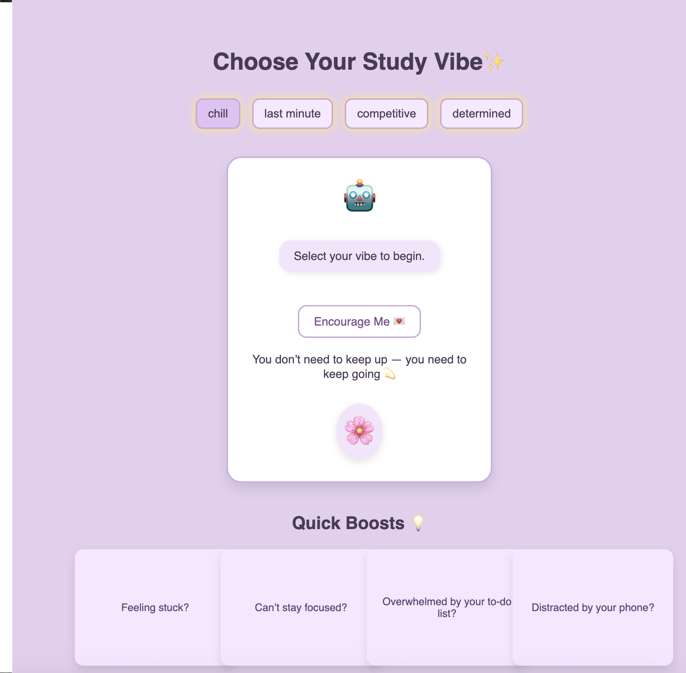
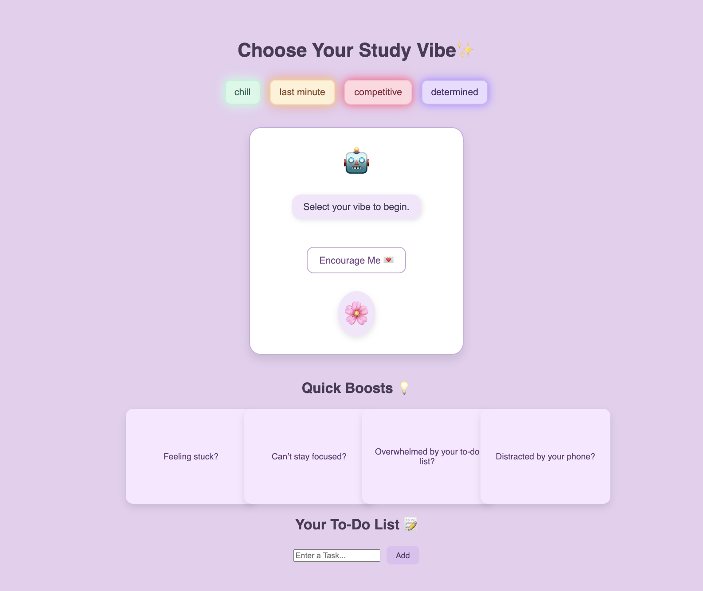
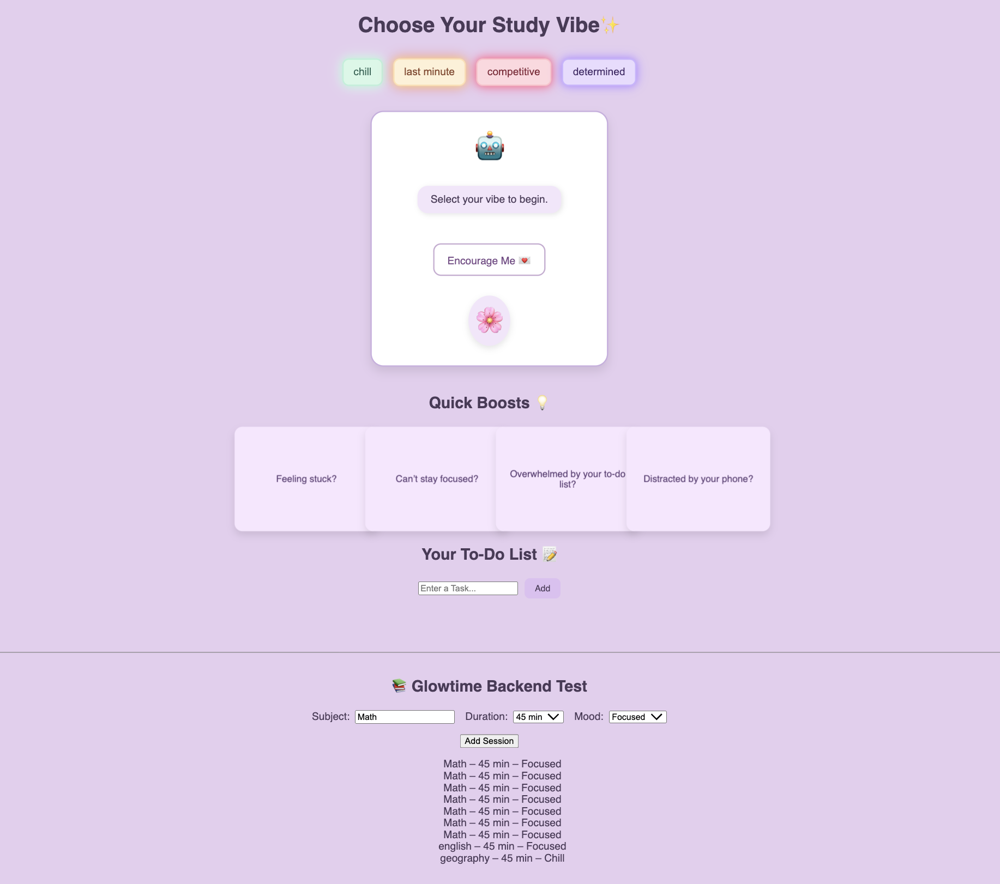

# Glowtime — Personalized Online Study Space  

Glowtime is a work-in-progress web application designed to help students stay focused, motivated, and productive.  
The idea is inspired by platforms like LifeAt, but with a more personal and interactive twist.  

---

## Features (Current & Planned)

- ✅ Add study sessions (subject, duration, mood)
- ✅ View all saved sessions (persisted in PostgreSQL)
- ✅ Frontend and backend connected (React ↔ Spring Boot REST API)
- ✅ Automatic proxy setup for API requests (no CORS issues)
- ✅ Simple React interface for testing features
- ✅ Reorganized backend code into model, repository, service, controller, and config packages
- ✅ Added `Todo` entity with fields: id, task, completed
- ✅ Implemented `TodoRepository` with custom query methods
- ✅ Created `TodoService` with methods for creating, retrieving, updating, and deleting todos
- ✅ Added validation annotations to the `Todo` entity
- ✅ Implemented `TodoController` with endpoints for CRUD operations on todos
- ✅ Connected frontend todo list to the backend API
- ✅ Added `spring-boot-starter-validation` dependency to support entity validation
- ✅ Added initial unit test coverage for `TodoService`

Planned / In Progress: 
-Add error handling and validation in the backend
-Expand unit test coverage for TodoService
-Implement user authentication and authorization
-Delete single sessions or clear all sessions
-Motivational avatar system with study vibes (competitive, chill, last-minute)
-"Quick Boosts" flip cards with mini study tips
-Study timers with ambient sounds
-Competitive mode where users can challenge each other on similar tasks 

---

## Tech Stack
**Frontend**: React (Vite)  
**Backend**: Spring Boot (Java), Spring Data JPA, Hibernate.
**Database**: PostgreSQL  
**Styling**: TailwindCSS (planned)  
**Tools**: Git, Maven
---

## Status
The frontend and backend are now connected, study sessions can be created, viewed, and deleted with data stored in PostgreSQL. The backend code has been reorganized into proper packages, and the `Todo` entity and related components have been implemented.

Next steps:  
-Add error handling and validation in the backend
-Expand unit test coverage
-Implement user authentication and authorization
-Add avatar system
-Polish UI with TailwindCSS
-Expand backend endpoints for more features  

###  Progress Screenshots  

**v1 – Initial UI**  
Basic layout with vibes and motivational cards, no to-do list or backend yet.  
  

**v2 – To-Do List Added**  
Introduced the to-do list feature, improved vibes buttons styling.  
  

**v3 – Backend Connected**  
Sessions can now be added (subject, duration, mood) and persisted in PostgreSQL via Spring Boot backend.  
  

---

## License
This project is shared publicly for demonstration and portfolio purposes only.  
Unauthorized use, reproduction, or modification of the code is prohibited.

